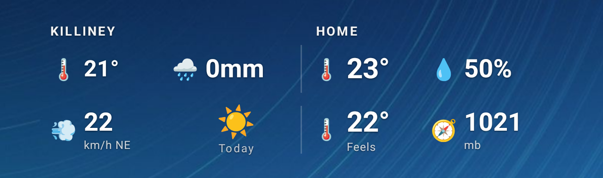
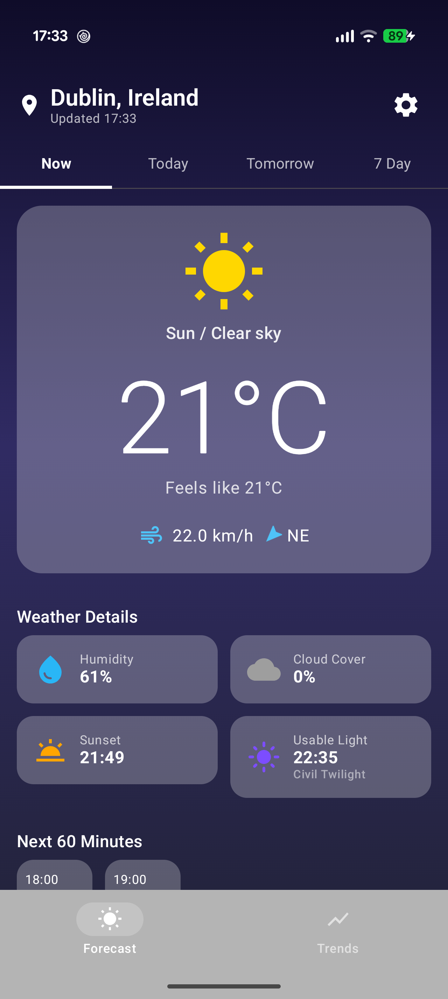
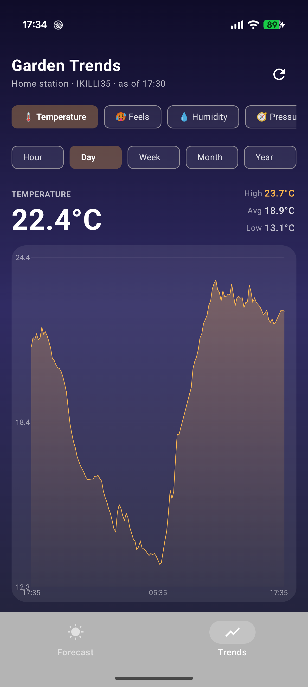

# Skyes Above

**A clean, three-source weather app for Android — with a home-screen widget that only ever shows you live data.**

Skyes Above pulls the forecast from three independent weather services at once and
**averages them together** for a more reliable reading than any single provider gives you.
It's built with Jetpack Compose and Material 3, and it comes with a transparent home-screen
widget that shows your local forecast next to your own back-garden weather station.

## Screenshots

  
   
  <em>The home-screen widget — your local forecast on the left, your garden station on the right.</em>

<table>
  <tr>
    <td align="center"><b>Home — now, hourly &amp; 7-day</b></td>
    <td align="center"><b>Garden trends</b></td>
  </tr>
  <tr>
    <td></td>
    <td></td>
  </tr>
</table>

## Why three sources?

Any one weather API can be wrong — a stale model run, a missing field, a bad station reading.
Skyes Above fetches all three in parallel and merges them, dropping empty/"missing" values so
one provider's gap doesn't drag the average down:

| Source | Coverage | When it's used |
| --- | --- | --- |
| **Met Éireann** | Ireland only | Forecast + live Dublin observations, when you're in Ireland |
| **Open-Meteo** | Global | Always on — the baseline everywhere |
| **OpenWeatherMap** | Global | When you've added a free API key in Settings |

Sun and twilight times come from the Sunrise–Sunset API, shown in your local time.

## Features

- **Now, hourly, and 7-day forecast** — current conditions up top, an hourly strip, and a
  week-ahead grid with daily highs and lows.
- **A full stats panel** — feels-like, humidity, wind speed and direction, pressure, UV index,
  cloud cover, visibility, and sunrise / sunset / civil-twilight times.
- **Pressure tendency** — a three-hour rising/falling/steady arrow and a low→high gauge, so you
  can read where the weather is heading.
- **Garden trends** — a dedicated Trends tab charting your own back-garden sensor history
  (temperature, humidity, pressure) over **Hour / Day / Week / Month / Year**, fed live from the
  companion [`wunderground-killi`](https://github.com/garnathan/wunderground-killi) Raspberry-Pi
  station.
- **On-device diagnostics** — see exactly what each data source returned (and *why* a fetch
  failed) without ever needing a cable or `logcat`.
- **Configurable** — auto-locate by GPS or pin a location (with Dublin / Cork / Galway quick
  picks), choose your home garden station, switch °C / °F, pick a light / dark / system theme,
  and add your OpenWeatherMap key.

## Tech stack

- **Kotlin** + **Jetpack Compose** (Material 3)
- **Hilt** for dependency injection
- **Retrofit** / **OkHttp** for the weather APIs
- **Kotlin Coroutines** for parallel fetches
- **WorkManager** for the widget's background refresh
- **DataStore** for settings
- Min SDK 26 · Target SDK 34

## Related project

- **[wunderground-killi](https://github.com/garnathan/wunderground-killi)** — the Raspberry-Pi
  garden weather station that publishes the sensor history this app charts and shows on the
  widget.
